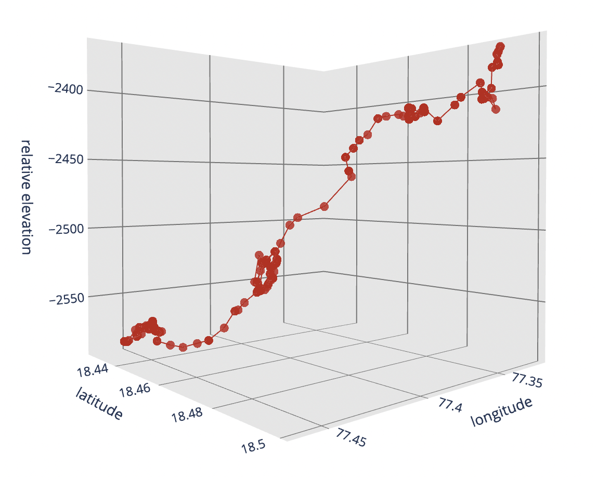

**Update:** Stopped automated data collection in June 2025.



# Percy waypoints

This repository contains code that automatically tracks the location of the Mars Perserverance rover, known as Percy, using Github Actions and [feeds](https://mars.nasa.gov/maps/location/?mission=M20) from NASA. The scripts run hourly.

## Inputs

The actions collect data from a two raw sources that feed NASA's rover [mapping application](https://mars.nasa.gov/maps/location/?mission=M20): 

- **Latest location** | [JSON](https://mars.nasa.gov/mmgis-maps/M20/Layers/json/M20_waypoints_current.json)
    - *Collected hourly*

- **Latest mission update** | [JSON](https://mars.nasa.gov/maps/location/api/configure/get?mission=M20)
    - *Collected hourly*

### Processing

The path and waypoints files are collected hourly and stored in a ["raw" directory](/data/raw/), with files stamped by the calendar date. Each daily file is the last location or mission update collected and committed during that day, if the location changes. 

For example, the waypoints:

```
waypoints_current_2024-04-04.json
waypoints_current_2024-03-31.json
waypoints_current_2024-04-01.json
```

And the mission files:

```
mission_2021-03-15.json
mission_2021-03-16.json
mission_2021-03-17.json
```

Those files are then collected, read, concatenated and processed in a [Jupyter notebook](/00-combine-daily-waypoints.ipynb) that outputs combined points and path files in GeoJSON format. 

### Outputs

- **Rover waypoints collection** | [GeoJSON points](data/processed/rover_points_full.geojson)
    - *March 15, 2021 - present*
- **Rover full path** | [GeoJSON linestring](data/processed/rover_path_full.geojson)
    - *March 15, 2021 - present*


### Metadata

The rover points file contains numerous columns explaining Percy's position, relative elevation, etc. Based on the context of Martian exploration and typical terminology used in planetary science, this is a general interpretation of the columns:

1. **RMC (Rover motion counter)**: A unique identifier for each drive or movement sequence performed by the rover.

2. **site**: Likely refers to a specific location or "site" the rover has visited or explored. This could be a numerical code or identifier unique to each location.

3. **drive**: A numerical identifier for each drive or movement the rover performs. This is likely unique within each site.

4. **sol**: A Martian solar day. The number of Martian days since the rover landed or the mission started.

5. **easting**, **northing**: Coordinates in a Martian mapping system, probably based on a specific Martian projection. These provide a 2D spatial location of the rover.

6. **elev_geoid**: The elevation relative to a Martian geoid, which is an equipotential surface of the planet's gravity field. Essentially, it's a measure of height relative to what would be considered "sea level" on Mars, though Mars has no seas.

7. **elev_radii**: Elevation measured from the center of Mars, giving a radial distance. This could be used to determine the rover's location relative to the Martian sphere.

8. **radius**: Likely the radial distance from the center of Mars to the rover's position. This might be similar to or a calculation based on `elev_radii`.

9. **roll**, **pitch**, **yaw**: These are the rover's orientation angles. Roll is rotation around the forward axis, pitch is rotation around the side-to-side axis, and yaw is rotation around the vertical axis.

10. **tilt**: The angle of inclination of the rover, possibly relative to the local surface or gravity vector.

11. **dist_m**, **dist_km**, **dist_mi**: Distances traveled by the rover, likely presented in meters, kilometers, and miles, respectively. This could be the distance for a particular drive or cumulatively.

12. **Note**: Additional information or annotations about the data point.

13. **date**: The Earth date corresponding to the Martian sol.

14. **geometry**: Spatial geometry information, typically storing the location in a format used by geospatial databases (e.g., a point geometry representing the rover'
s position).

15. **name**: Possibly the name of the feature, site, or point of interest the rover is studying or has traveled to.

16. **isPanoramic**: A boolean indicating whether an associated image or observation is panoramic.

17. **url**: The URL for an image or data point associated with the rover's position or observation.

18. **rows**, **columns**: Dimensions of an image or data matrix, likely relating to panoramic images or other observational data.

19. **azmin**, **azmax**, **elmin**, **elmax**, **elzero**: These likely refer to azimuth (horizontal angle) and elevation (vertical angle) ranges for panoramic images or observational instruments. `azmin` and `azmax` would be the minimum and maximum azimuth angles, while `elmin` and `elmax` are the minimum and maximum elevation angles. `elzero` might be a baseline or reference elevation angle.

20. **earth_days**: The equivalent duration on Earth for the number of Martian sols. This is calculated by me in the notebook, like this: 

```
sol_length_in_earth_days = 1 + 39 / (60 * 24) + 35 / (60 * 60 * 24)
```

```
gdf["earth_days"] = (
    gdf["sol"] * sol_length_in_earth_days
).round()
```

---

**Questions? Thoughts?** 

Please [email me](mailto:mattstiles@gmail.com). 

Happy roving! 
